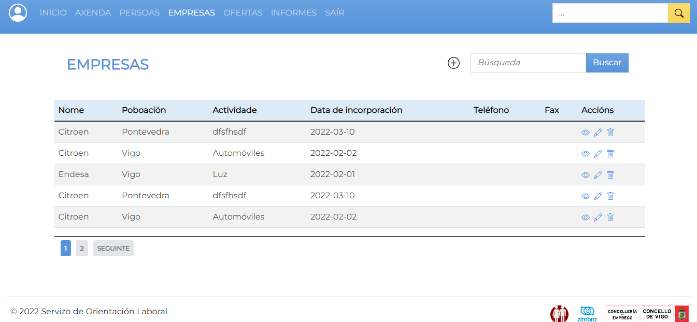
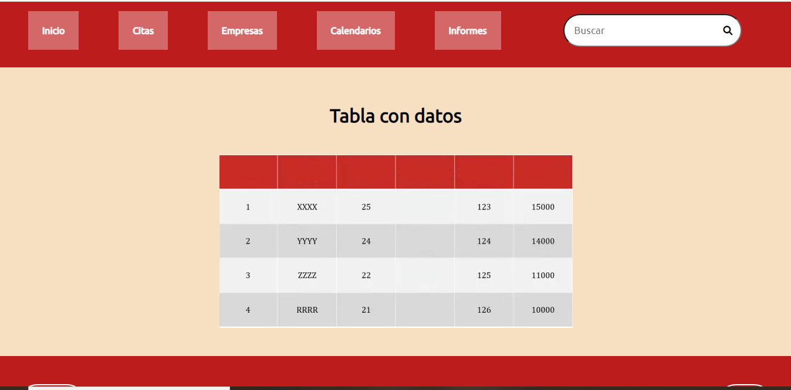
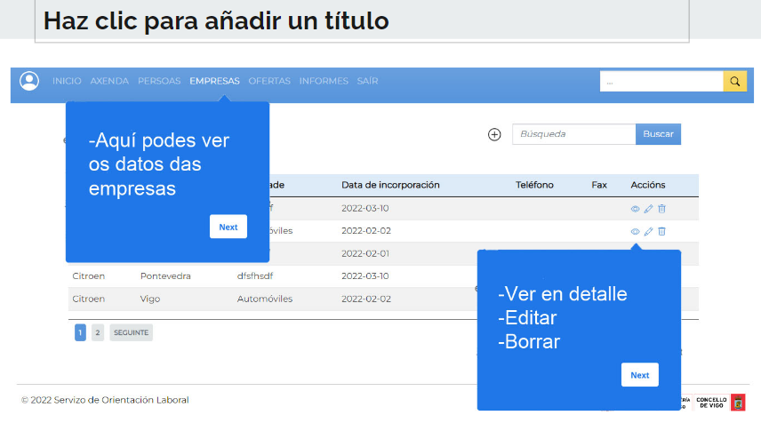

# Propostaobra

## Taboa de contidos

A miña proposta poderíase dividir en 3 partes: deseño máis moderno e sinxelo, máis clicabilidade e chamadas a acción e tooltips.

# Deseño moderno

As propostas iniciais da obra eran demasiado estáticas. O deseño era moi reminiscente das webs existentes do concello pero nós temos alma de poeta e non hai razón para constreñirse a estes límites tan arbitrarios. Eu digo que é hora de soltar a imaxinación:

Mantemos as cores corporativas pero avivamos as variacións de tonos, diriximos a mirada do espectador máis eficientemente, invitamos ao internauta a que utilice as nosas utilidades, sen medo.



Con estas cores cálidas pero intrigantes atraeremos a todos os visitantes do concello, que posiblemente visiten a intranet tamén. É cuestión de facela usable e responsiva para todos, non só para os profesionais do concello!

## Máis clicabilidade

O deseño anterior fúndese demasiado co fondo, non destaca, apenas ten chamadas a acción. É hora de cambiar iso! Engadiremos máis efectos hover, máis contraste nos elementos interactuables, máis iconas que se distingan do fondo. Podemos usar como base a plantilla antiga que de feito conseguía esto dunha maneira moi eficiente.



obviamente co deseño ben actualizado, pero no apartado de interaccións esta web era moito máis navegable, e deberíamos recuperar un pouco a maxia dese primeiro prototipo.

# Tooltips

Crias que xa me rendera con elas? Non señor! Dende a anterior proposta estiven investigando como se poderían implementar e, inda que xa non estou convencido co anterior plan de facelas mediante cookies, ocórreseme unha idea aínda mellor:

Unha idea moito máis moderna sería usar o local storage:

```php
if( !window.localStorage) {
    // Se non hai localstorage pois non o usa
    // tamén se asegura de que o navegador non faga nada se a cousa
    // non funciona.
}
else {
    if( !window.localStorage.isReturningVisitor) {
        // se si funciona, pois pone en marcha a función
        window.localStorage.isReturningVisitor = true;
    }
}
```

Logo só e caso de facer unha function que mostre os tooltips só se non hay localstorage no navegador e polo tanto é un primeiro visitante. Fácil, sinxelo e para toda a familia, como di o de Bricomanía.



## Conclusión

O que esta obra necesita é un lavado de cara con máis usabilidades e máis guías que nos aforren no futuro facer o manual de usuario. Desta maneira matamos duas puchiñas dun tiro.
